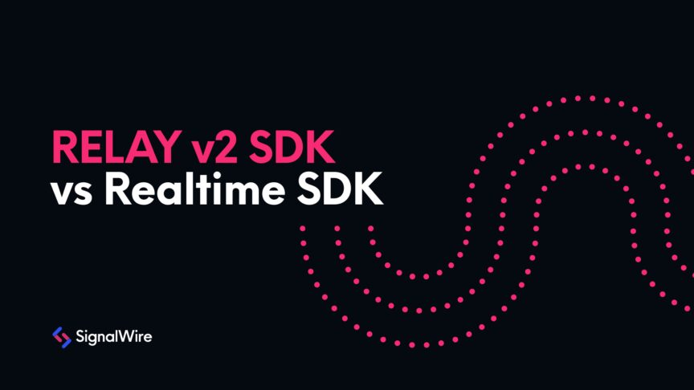
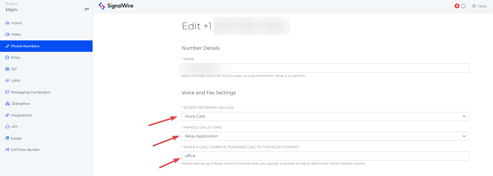

# Upgrade Your RELAY Game
### Examples for Refactoring RELAY v2 SDK to the Newest Realtime SDK



Since the launch of our RELAY Realtime SDK in May 2022, we've been actively promoting its use among our customer
base. As revealed in our [May Fresh off the Wire blog](https://signalwire.com/blogs/product/fresh-off-the-wire-may-2022),
our SDK has undergone significant enhancements, now incorporating **Voice**, **Messaging**, **Video**, **Tasks**, and 
**Chat** all under one roof. We suggested that those using the outdated RELAY SDK (v2) consider upgrading to this new 
version to leverage its expanded capabilities. With the integration of **Voice** and **Messaging** into the v3 Realtime SDK came
some syntax modifications - changes we're more than ready to help you navigate.

## Introduction

In both the legacy and the latest versions of the RELAY SDK, there's no requirement to incorporate our SignalWire phone 
number into the code for the purpose of receiving calls and messages. Rather, we set up a corresponding **Context** in 
the Dashboard for the number you intend to use. You can achieve this by going to the Phone Numbers tab within your 
[SignalWire Space](https://developer.signalwire.com/guides/navigating-your-space/), choosing the number you want to modify,
and then hitting the “**Edit Settings**” button on the new page that appears. Moving forward, you'll want to arrange the 
Voice settings as follows:
- Configure "Accept Incoming Calls as" to: **Voice Calls**
- Define "Handle Calls using" as: **Relay Application**
- Specify "Context" as: **The context you've already set up on your Relay Server**




The major shifts from v2 to the v3 Realtime SDK involve the removal of the **Consumer** and the exclusive use of **asynchronous**
methods. If you haven't yet delved into the [documentation](https://developer.signalwire.com/sdks/reference/realtime-sdk),
we offer some practical examples to kickstart your refactoring journey. In our v2 samples, you'll notice the use of Consumers
and a blend of synchronous and asynchronous methods. On the other hand, Realtime SDK examples employ event listeners to 
track ending events and utilize top-level asynchronous wrappers. By comparing these two approaches, we aim to illuminate
the upgrade process, making it less of a mystery.


## Connection

In the context of the v2 Node SDK, the **RelayConsumer** was an integral component for developers. It encapsulated much of 
the connection management details. This simplicity, however, came at the cost of reducing the developers' control over 
their connections.

#### v2 Node Relay SDK Example:

```javascript
import { RelayConsumer } from '@signalwire/node'

const consumer = new RelayConsumer({
    project: "<project-id>",  // SignalWire Project ID Here
    token: "<auth-token>",  // SignalWire API Auth Token Here
    contexts: ["test"],
    ready: async () => console.log("Consumer ready...."),
    onIncomingCall: async (call) => console.log("Got call", call.from, call.to),
    onIncomingMessage: async (message) => console.log(`Got Message: ${message.message}`)
});


consumer.run()
```

Conversely, the newer Realtime SDK shifts connection management responsibility to the client object. This transfer of 
control enables developers to manage their connections manually, thus affording a higher level of flexibility and 
specificity. This change also makes it possible for developers to create different client objects for various services 
like **Voice** and **Messaging**. This can be quite advantageous, particularly in large and complex applications where unique 
settings and handlers are necessary for different application aspects.

This approach offers developers increased control over their connections and their interaction with the SignalWire API.

#### v3 Realtime Relay SDK Example:
```javascript
import { Voice, Messaging } from "@signalwire/realtime-api";

const voice_client = new Voice.Client({
    project: "<project-id>", // SignalWire Project ID Here
    token: "<auth-token>", // SignalWire API Auth Token Here
    contexts: ["<context>"]

});

const message_client = new Messaging.Client({
    project: "<project-id>", // SignalWire Project ID Here
    token: "<auth-token>", // SignalWire API Auth Token Here
    contexts: ["<context>"]
})

voice_client.on("call.received", async (call) => {
    console.log("Got call", call.from, call.to);
})

message_client.on("message.received", async (message) => {
    console.log(`Got Message: ${message.message}`)
})
```

## Voice

SignalWire's Voice namespace has many available methods to help you build powerful and full-featured voice applications
like an Interactive Voice Response (IVR) and automated appointment reminders. We will utilize several of these
methods as we demonstrate how to make, receive, and record calls. We will even look at more complex methods like playing
text-to-speech messages over an audio track. Then you can mix-and-match any of these methods to best suit your needs.

### Making a Call
In the previous version (v2) of the RELAY SDK, Voice API interactions were performed and handled via a **RelayConsumer**, tasked with managing 
real-time calling events. The following v2 example demonstrates how a call might have been made using a Consumer.

#### v2 Node Relay SDK Example:
```javascript
import { RelayConsumer } from '@signalwire/node'

const consumer = new RelayConsumer({
    project: '<project-id>', // SignalWire Project ID Here
    token: '<auth-token>', // SignalWire API Auth Token Here
    contexts: ['<context>'],
    ready: async (consumer) => {
        const dialResult = await consumer.client.calling.dial({
            type: 'phone',
            from: '+1XXXXXXXXXX', // Must be a number in your SignalWire Space
            to: '+1YYYYYYYYYY'
        })
        const { successful, call } = dialResult
        if (!successful) {
            console.error('Dial error..')
            return
        }
        console.log(dialResult)
    }
})

consumer.run()
```

Unlike the deprecated RELAY SDK, the updated RELAY Realtime SDK does not make use of Consumers. Instead, it operates via
a **Client** within a specific namespace that you want to access. You can find all available methods and events in our 
[Voice Client SDK reference](https://developer.signalwire.com/sdks/reference/realtime-sdk/voice/voice-client). The 
Realtime Client methods must be awaited, thus our logic should be encapsulated in an asynchronous function. 
The new way to initiate a call with this version is as follows:

#### v3 Realtime Relay SDK Example:
```javascript
import { Voice } from  "@signalwire/realtime-api";

const client = new Voice.Client({
    project: '<project-id>', // SignalWire Project ID Here
    token: '<auth-token>', // SignalWire API Auth Token Here
    contexts: [`<context>`],
});

async function main() {
    const call = await client.dialPhone({
        from: '+1XXXXXXXXXX', // Must be a number in your SignalWire Space
        to: '+1YYYYYYYYYY'
    });
    console.log(call.device)
};
main().catch(console.error)
```

### Receiving a Call
When receiving a call with the deprecated (v2) RELAY SDK, we could use our Consumer to set up an event listener to listen
for incoming calls.

#### v2 Node Relay SDK Example:
```javascript
import { RelayConsumer } from '@signalwire/node'

const consumer = new RelayConsumer({
    project: '<project-id>', // SignalWire Project ID Here
    token: '<auth-token>', // SignalWire API Auth Token Here
    contexts: ['<context>'],
    onIncomingCall: async (call) => {
        const { successful } = await call.answer()
        if (!successful) {
            console.error('Answer Error')
            return
        }
        console.log("Inbound Call answered")
        await call.hangup()
    }
})
consumer.run()
```

Inbound calls with the (v3) Realtime-Relay version do not require a Consumer but instead put a **call.received** event 
listener directly on the namespace Client.

#### v3 Realtime Relay SDK Example:
```javascript
import { Voice } from "@signalwire/realtime-api";

const client = new Voice.Client({
    project: '<project-id>', // SignalWire Project ID Here
    token: '<auth-token>', // SignalWire API Auth Token Here
    contexts: ['<context>'],
});

client.on("call.received", async (call) => {
    try {
        await call.answer();
        console.log("Inbound call answered");
        await call.hangup()

    } catch (error) {
        console.error("Error answering inbound call", error);
    }
});
```

### Playing TTS Over Audio

In our next Voice example, let’s look at how you might utilize text-to-speech. In the deprecated (v2) RELAY SDK, **playTTS** was 
available as an asynchronous or synchronous function. In the synchronous version, we can simply allow the script to move
on synchronously after the TTS is finished, like such:

```javascript
const playAction = await call.playTTS({text: 'Welcome to SignalWire!'})
console.log("playAction 1 has finished!")
const playAction2 = await call.playTTS({text: 'Now playing playAction 2 and then ending call... Goodbye!'})
console.log("playAction 2 has finished!")
call.hangup()
```

However, when using the asynchronous version of playTTS, called **playTTSAsync** in v2, all operations will occur 
asynchronously. Therefore, we need to listen for events to guide our code when to trigger. We can use the **on**, 
**waitFor** or **waitForEnded** methods for this purpose. However, we can't use these methods directly on the 
playAction. Instead, we need to apply one of these methods to the call directly. As a result, we'll listen for all 
**play.finished** events that happen on the call. Since we're listening to all **play.finished** events, we need to keep
track of the last playAction that finished, so we can accurately point to the correct callback/trigger. In the following
example, I'm tracking if the current playAction is the first playTTSAsync that has occurred on the call with:
```javascript
let firstTTS = true
```

Once the first **playTTSAsync** event has been passed to us, we then set **firstTTS** to false, so the next event will point
to the correct part of the code. Example Below:

#### v2 Node Relay SDK Example:
```javascript
import { RelayConsumer } from '@signalwire/node'

const consumer = new RelayConsumer({
    project: `<project-id>`, // SignalWire Project ID Here
    token: `<auth-token>`, // SignalWire API Auth Token Here
    contexts: ['<context>'],
    onIncomingCall: async (call) => {

        let firstTTS = true
        let playAction

        const {successful} = await call.answer()
        if (!successful) {
            console.error('Answer Error')
            return
        }
        console.log("Inbound call answered")

        playAction = await call.playTTSAsync({text: 'Welcome to SignalWire!'})

        call.on('play.finished', async () => {
            if (firstTTS) {
                console.log("playAction 1 has finished!")
                playAction = await call.playTTSAsync({text: 'Now playing playAction 2 and then ending call... Goodbye!'})
                firstTTS = false
                return
            }
            console.log("playAction 2 has finished!")
            call.hangup()
        })
    }
})
consumer.run()
```

The Realtime SDK (V3) implementation does not have synchronous methods, however, V3 no longer has the limitation of not 
being able ot utilize the **waitForEnded** (which is now **ended**) method directly on the **playAction**. Due to this, we can directly listen for
when the **playTTS** is finished before moving forward to the next logic within our code. This results in a much simpler syntax and
more granular control of the call.

#### v3 Realtime Relay SDK Example:
```javascript
import { Voice } from "@signalwire/realtime-api";

const client = new Voice.Client({
    project: '<project-id>', // SignalWire Project ID Here
    token: '<auth-token>', // SignalWire API Auth Token Here
    contexts: ['<context>'],
});

client.on("call.received", async (call) => {
    try {
        await call.answer();
        console.log("Inbound call answered");

        const playAction = await call.playTTS({text: 'Welcome to SignalWire!'})
        await playAction.ended()
        console.log("playAction 1 has finished!")

        const playAction2 = await call.playTTS({text: 'Now playing playAction 2 and then ending call... Goodbye!'})
        await playAction2.ended()
        console.log("playAction 2 has finished!")


        await call.hangup()

    } catch (error) {
        console.error("Error answering inbound call", error);
    }
});
```

### Recording a Call

For our final Voice example, let’s look at how we could utilize the Call Recording method. RELAY v2 SDK provided
synchronous and asynchronous call recording methods while the v3 version remains to only have synchronous methods.

For this example, we will initiate the first **playAction** when the call is answered. Once the first **playAction** has 
finished playing, we will then begin the recording of the call. After the second **playAction** is finished playing, we 
will then end the recording with the **stop** method. Once the recording has returned the **ended** event, we then log the 
recording url and then end the call with the **hangup** method.

In the below example, we will be utilizing the **recordAsync** method, therefore we will need to add another event listener
for when a recording has ended.

#### v2 Node Relay SDK Example:
```javascript
import { RelayConsumer } from '@signalwire/node'

const consumer = new RelayConsumer({
    project: `<project-id>`, // SignalWire Project ID Here
    token: `<auth-token>`, // SignalWire API Auth Token Here
    contexts: ['<context>'],
    onIncomingCall: async (call) => {

        let firstTTS = true
        let recordAction
        let playAction

        const {successful} = await call.answer()
        if (!successful) {
            console.error('Answer Error')
            return
        }
        console.log("Inbound call answered")

        playAction = await call.playTTSAsync({text: 'Welcome to SignalWire!'})

        call.on('play.finished', async () => {
            if (firstTTS) {
                console.log("playAction 1 has finished!")
                console.log("Starting recording...")

                recordAction = await call.recordAsync({direction: 'both'})
                playAction = await call.playTTSAsync({text: 'Now playing playAction 2 and then ending call... Goodbye!'})
                firstTTS = false
                return
            }
            console.log("playAction 2 has finished!")
            await recordAction.stop()
        })


        call.on('record.finished', () => {
            console.log(`URL of call recording: ${recordAction.result.url}`)
            call.hangup()

        })
    }
})
consumer.run()
```

In the Realtime Relay (v3) SDK, this becomes a lot simpler to pull off. Like above in the **playTTS**, we will simply just
need to wait for the **playAction** to end with the **ended** method, which we will then follow up and stop the recording
with the **stop** method.

#### v3 Realtime Relay SDK Example:
```javascript
import { Voice } from "@signalwire/realtime-api";


const client = new Voice.Client({
    project: '<project-id>', // SignalWire Project ID Here
    token: '<auth-token>', // SignalWire API Auth Token Here
    contexts: ['<context>'],
});

client.on("call.received", async (call) => {
    try {
        await call.answer();
        console.log("Inbound call answered");

        const playAction = await call.playTTS({text: 'Welcome to SignalWire!'})
        await playAction.ended()
        console.log("Playback 1 has finished!")
        console.log("Starting recording...")

        const recording = await call.recordAudio({direction: "both"})


        const playAction2 = await call.playTTS({text: 'Now playing playAction 2 and then ending call... Goodbye!'})
        await playAction2.ended()
        console.log("Playback 2 has finished!")
        await recording.stop()
        
        console.log(recording.url)
        await call.hangup()

    } catch (error) {
        console.error("Error answering inbound call", error);
    }
});
```


## Messaging

Messaging is much less complex than Voice because the only interactive methods available are sending and receiving. So, 
let’s look at the differences in examples of outbound messages, inbound messages, and forwarding messages.


### Sending a Message

In our v2 example, we used a RelayClient to send the SMS and, if successful, logged the message id.

#### v2 Node Relay SDK Example:
```javascript
import { RelayConsumer } from '@signalwire/node'
const client = new RelayClient({
    project: "<project-id>", // SignalWire Project ID Here
    token: "<api-token>", // SignalWire API Auth Token Here
});

async function main() {
    const sendResult = await client.messaging.send({
        contexts: ["<context>"],
        from: "+1XXXXXXXXXX", // Must be a number in your SignalWire Space
        to: "+1YYYYYYYYYY",
        body: "Welcome to SignalWire!",
    });

    if (sendResult.successful) {
        console.log("Message ID:", sendResult.messageId);
    }
}

main().catch(console.error);
```

Our latest version creates a messaging Client, sends a message using the same syntax, and returns a promise with a 
message result string rather than a success boolean.

#### v3 Realtime Relay SDK Example:
```javascript
import { Messaging } from "@signalwire/realtime-api";

const client = new Messaging.Client({
  project: "<project-id>", // SignalWire Project ID Here
  token: "<api-token>", // SignalWire API Auth Token Here
  contexts: ["<context>"],
});

async function main() {
    let sendResult = await client.send({
        context: "<context>",
        from: "+1XXXXXXXXXX", // Must be a number in your SignalWire Space
        to: "+1YYYYYYYYYY",
        body: "Hello World!",
    });
    console.log("Message ID:", sendResult.messageId);
}
main().catch(console.error)
```


### Receiving a Message

With the old v2 version of the SDK, you would listen for incoming messages with a Consumer. If we wanted to send an 
automatic SMS response, we'd have to access the send method within **onIncomingMessage** with **consumer.client.messaging.send**.

#### v2 Node Relay SDK Example:
```javascript
import { RelayConsumer } from '@signalwire/node'

const consumer = new RelayConsumer({
    project: "<project-id>", // SignalWire Project ID Here
    token: "<auth-token>", // SignalWire API Auth Token Here
    contexts: ["<context>"],
    onIncomingMessage: async (message) => {
        console.log("Received message", message.id);
        const customer = message.from;
        const sendResult = await consumer.client.messaging.send({
            context: "test",
            from: "+1XXXXXXXXXX", // Must be a number in your SignalWire Space
            to: customer,
            body: `We have received your message: \n${message.body}`,
        });
        if (sendResult.successful) {
            console.log("Message ID:", sendResult.messageId);
        } else {
            console.log(sendResult.errors);
        }
    },
});

consumer.run();
```


The new Realtime SDK provides the same functionality with a simpler syntax.
#### v3 Realtime Relay SDK Example:
```javascript
import {Messaging} from "@signalwire/realtime-api";

const client = new Messaging.Client({
    project: "<project-id>", // SignalWire Project ID Here
    token: "<auth-token>", // SignalWire API Auth Token Here
    contexts: ["<context>"], 
});

client.on("message.received", async (message) => {
    console.log("message.received", message);
    let customer = message.from
    let sendResult = await client.send({
        context: "<context>",
        from: "+1XXXXXXXXXX", // Must be a number in your SignalWire Space
        to: customer,
        body: `We have received your message: \n${message.body}`,

    }).catch(console.error);
    console.log("Message ID:", sendResult.messageId);
});
```


### Conclusion

As you can see from all the examples above, the new RELAY Realtime SDK introduces just a few minor changes from the old 
RELAY SDK v2. Some small syntax changes to an existing v2 application can make it easier to take advantage of all the 
namespaces and products SignalWire offers if you want to improve or expand your application in the future. A chat 
feature can trigger Voice calls, an IVR could allow a customer to call into a video call.

Here are a few resources for more technical references and examples:

- [Getting Started](https://developer.signalwire.com/sdks/reference/realtime-sdk/#get-started)
- [RELAY Realtime SDK technical reference](https://developer.signalwire.com/sdks/reference/realtime-sdk/)

We hope you can easily take advantage of new features as they are released, but if you need help, you can always reach 
out to Support with the help button on your Dashboard.